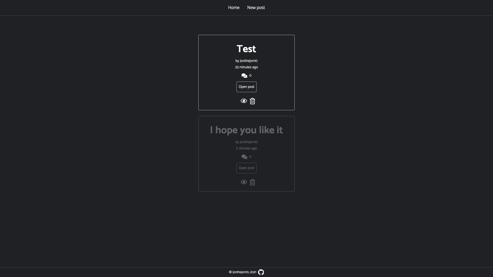
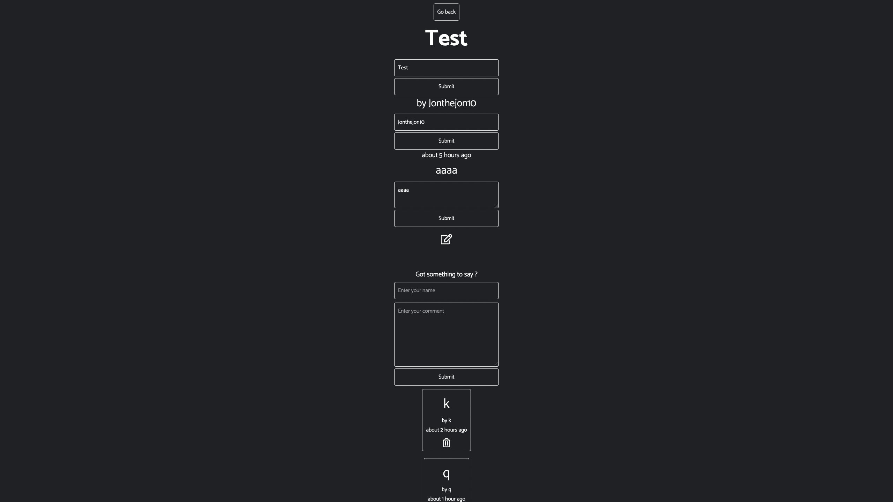

# Blog CMS

## Made with React, Redux toolkit, SCSS, PassportJS and JWT for authentication and protected edit-ability.

<a href='https://jonthejon10.github.io/blog-cms/'>Live preview</a>

The command center of the Full Stack blog application.
Here you can update, delete, or create new posts and comments, provided you enter the right credentials.

Check out the backend: https://github.com/Jonthejon10/blog-api-backend

Or maybe the frontend: https://github.com/Jonthejon10/blog-api-frontend

